# Assignment 5: Themes and Device Support
This assignment, the fifth in the series, will familiarize the student with theming and styling an Android application, all while supporting different screen densities, orientations, sizes, and OS versions. 

## Table of Contents
<!-- START doctoc generated TOC please keep comment here to allow auto update -->
<!-- DON'T EDIT THIS SECTION, INSTEAD RE-RUN doctoc TO UPDATE -->

- [Assignment 5: Themes and Device Support](#assignment-5-themes-and-device-support)
  - [Overview](#overview)
  - [Learning Objectives](#learning-objectives)
  - [Prerequisites](#prerequisites)
  - [Grading Criteria](#grading-criteria)
    - [Theme Setup](#theme-setup)
      - [Dark Theme](#dark-theme)
      - [Light Theme](#light-theme)
      - [Dark Theme Icons](#dark-theme-icons)
      - [Light Theme Icons](#light-theme-icons)
      - [Examples](#examples)
        - [App on Android < 3.0 (API < 11), normal size device, portrait (showing menu open)](#app-on-android--30-api--11-normal-size-device-portrait-showing-menu-open)
        - [App on Android < 3.0 (API < 11), normal size device, landscape](#app-on-android--30-api--11-normal-size-device-landscape)
        - [App on Android 3.0+ (API 11+), normal size device, portrait](#app-on-android-30-api-11-normal-size-device-portrait)
        - [App on Android 3.0+ (API 11+), large size device, portrait](#app-on-android-30-api-11-large-size-device-portrait)
        - [App on Android 3.0+ (API 11+), large size device, landscape](#app-on-android-30-api-11-large-size-device-landscape)
  - [Helpful Resources](#helpful-resources)
  - [Submission Instructions](#submission-instructions)
    - [Git Workflow](#git-workflow)
  - [Help and Discussion](#help-and-discussion)

<!-- END doctoc generated TOC please keep comment here to allow auto update -->

## Overview
The student must build a single Activity application that displays themed screens, laid out depending on the screen size and orientation of the device. The app must be able to toggle and reload its theme at runtime. The student will be provided user interface resources to support the themes, provided at the highest density the app must support (xhdpi / 320 dpi).

## Learning Objectives
When completed the student should have an understanding of the following concepts:

* Multiple screen density support
* Multiple screen orientation support
* Multiple screen size support
* Theming and styling
* Stretchable 9 patches
* State list drawables
* Creating and using configuration specific resources

## Prerequisites
Before starting this tech challenge, a student should be familiar with the follow concepts and have the following environment

* All prior Android Assignments are completed
* The Android SDK installed on the development device
* Android Studio (the latest stable release) installed on the development device

## Grading Criteria
Here are some specific requirements the graders will be looking for in your submission in order for your submission to be accepted:

1. Support at a minimum Android 2.2 (API 8), and work with the latest version of Android (API 17+).
2. Contain and use ONLY one Activity.
3. The app may NOT set ANY view attributes in code, they must ALL be set in xml using themes/styles/layouts. No credit will be given for circumventing using themes/styles.
4. Have density specific versions for every drawable (EXCEPT the buttons) that support mdpi, hdpi, and xhdpi at the appropriate sizes. 
5. Use a custom dark (default) and light theme, that use custom attributes to set view properties.
6. Allow its theme to be toggled at runtime by an action bar item (3.0+) or menu item (< 3.0), depending on the OS version.
7. Save the current theme “state” that it is set to and restore it on orientation change (or low memory situations).
8. Support 4 different layouts, depending on screen size and orientation (must match screenshots below)

Students will be provided the highest supported resolution for all drawable resources required. They will need to use a simple image editing tool to size down the resources to the correct proportional size for each density. The button drawables are not usable as provided, and must be converted into stretchable/readme-images 9.png (9-patch) files using the Draw 9-Patch tool provided with the Android SDK [http://developer.android.com/tools/help/draw9patch.html](http://developer.android.com/tools/help/draw9patch.html).
Resources needed for the completion of the assignment can be found in "*./supporting-resources/*"

### Theme Setup

Both the custom Dark and Light themes should be inherited from system themes, which will allow for other default view properties to remain unchanged. Depending on the version of the OS the app is running on, the themes need to inherit from differing system themes. This should be done using theme/style inheritance.

|                      | ***Dark Theme***     | ***Light Theme***         |
| -------------------- | -------------------- | ------------------------- |
| ***API <11 (<3.0)*** |  android:Theme       | android:Theme.Light       |
| ***API 11+ (3.0+)*** |  android:Theme.Holo  | android:Theme.Holo.Light  |

The view layout that will be reused in other layouts contains 3 text views and a button, oriented vertically, centered in their parent view group. This layout should be created once, and then referenced in configuration specific layouts using </include> tags. Below shows how the view should look, and its view’s properties, depending on the theme.

#### Dark Theme

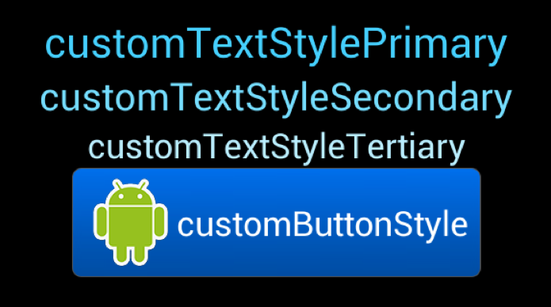

|                        | Text Color | Text Size | Background Not Pressed State   | Background Pressed State     | Left Drawable         |
| ---------------------- | ---------- | --------- | ------------------------------ | ---------------------------- | --------------------- |
| ***ViewGroup parent*** | X          | X         | #000000                        | X                            | X                     |
| ***TextView 1***       | #45D0FF    | 22sp      | X                              | X                            | X                     |
| ***TextView 2***       | #75DDFF    | 20sp      | X                              | X                            | X                     |
| ***TextView 3***       | #BAEEFF    | 18sp      | X                              | X                            | X                     |
| ***Button***           | #FFFFFF    | 18sp      | `custom_button_dark`           | `custom_button_dark_pressed` | `ic_launcher_android` |

#### Light Theme

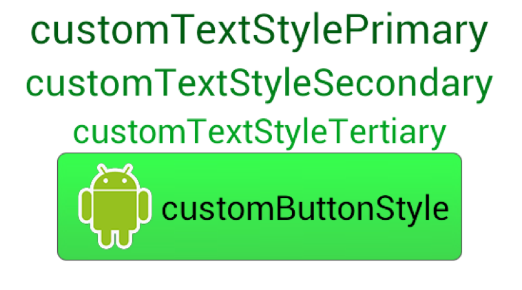

|                        | Text Color | Text Size | Background Not Pressed State    | Background Pressed State      | Left Drawable         |
| ---------------------- | ---------- | --------- | ------------------------------- | ----------------------------- | --------------------- |
| ***ViewGroup parent*** | X          | X         | #FFFFFF                         | X                             | X                     |
| ***TextView 1***       | #005C12    | 22sp      | X                               | X                             | X                     |
| ***TextView 2***       | #00821A    | 20sp      | X                               | X                             | X                     |
| ***TextView 3***       | #00A321    | 18sp      | X                               | X                             | X                     |
| ***Button***           | #000000    | 18sp      | `custom_button_light`           | `custom_button_light_pressed` | `ic_launcher_android` |

The actionbar and menu item icons must also be themed. Depending on OS version the app is running on, a different drawable should be used.

#### Dark Theme Icons

**Android < 3.0**

 

**Android 3.0+**

 

#### Light Theme Icons

**Android < 3.0**

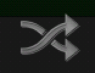 

**Android 3.0+**

 

|                                              | Dark Theme                    | Light Theme                    |
| -------------------------------------------- | ----------------------------- | ------------------------------ |
| ***API <11 (<3.0) Menu Icon Drawable***      | `ic_menu_toggle_theme`        | `ic_menu_toggle_theme`         |
| ***API 11+ (3.0+) Actionbar Icon Drawable*** | `ic_action_toggle_theme_dark` | `ic_action_toggle_theme_light` |

#### Examples 

##### App on Android < 3.0 (API < 11), normal size device, portrait (showing menu open)

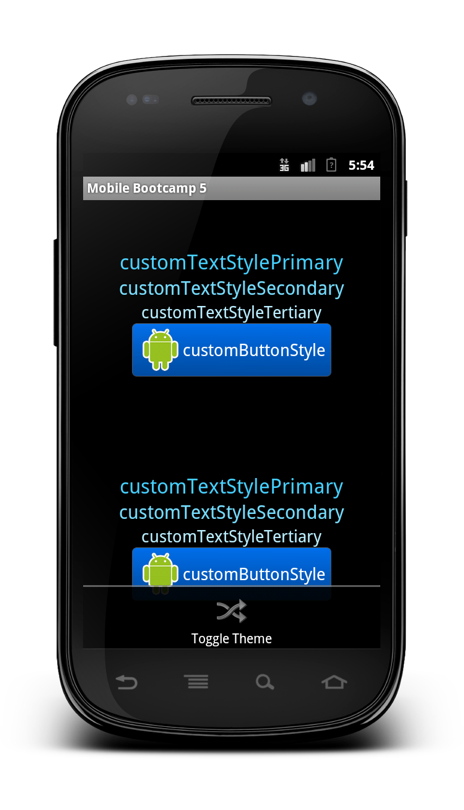
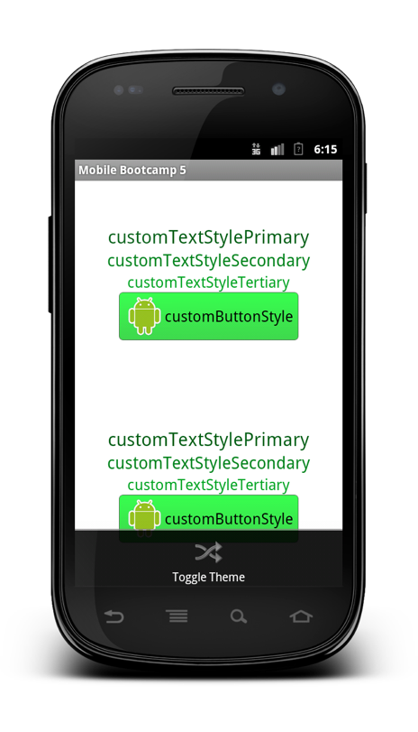

##### App on Android < 3.0 (API < 11), normal size device, landscape

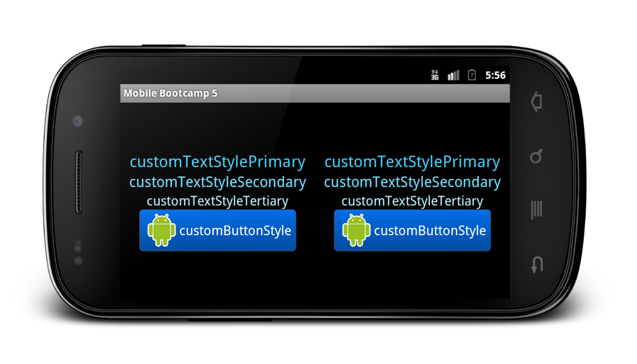
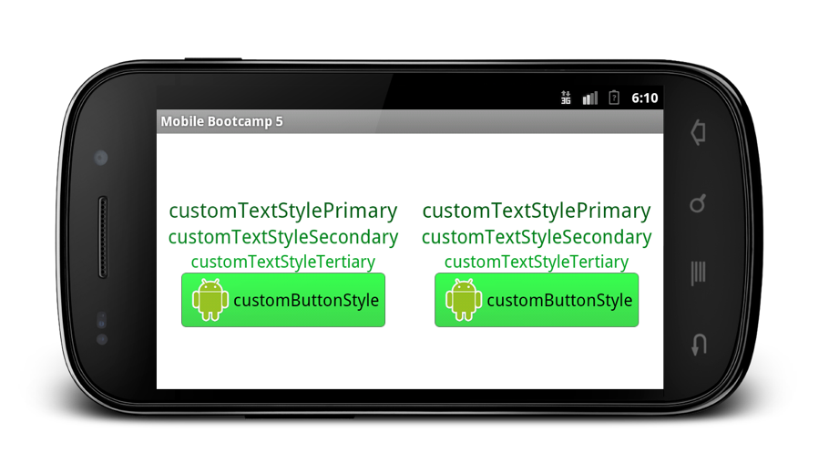

##### App on Android 3.0+ (API 11+), normal size device, portrait

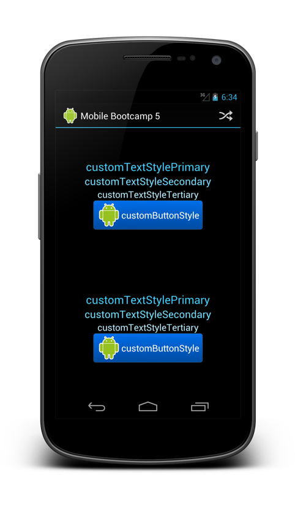
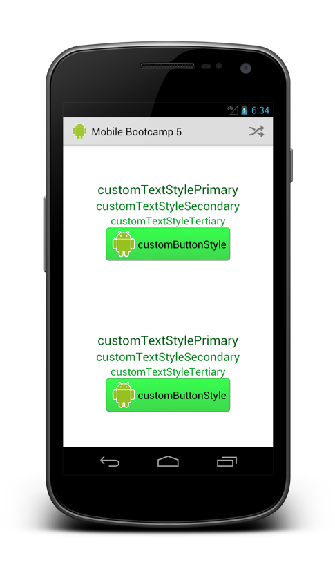

##### App on Android 3.0+ (API 11+), large size device, portrait

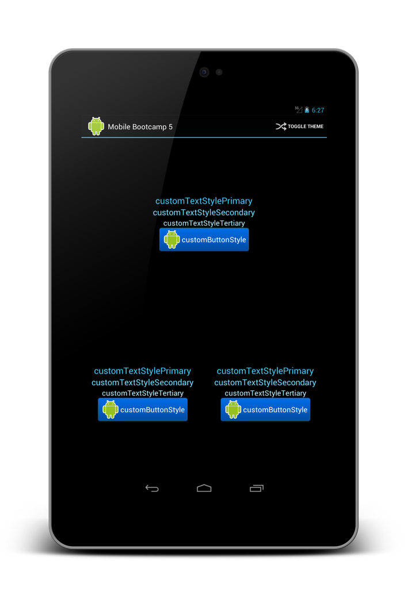
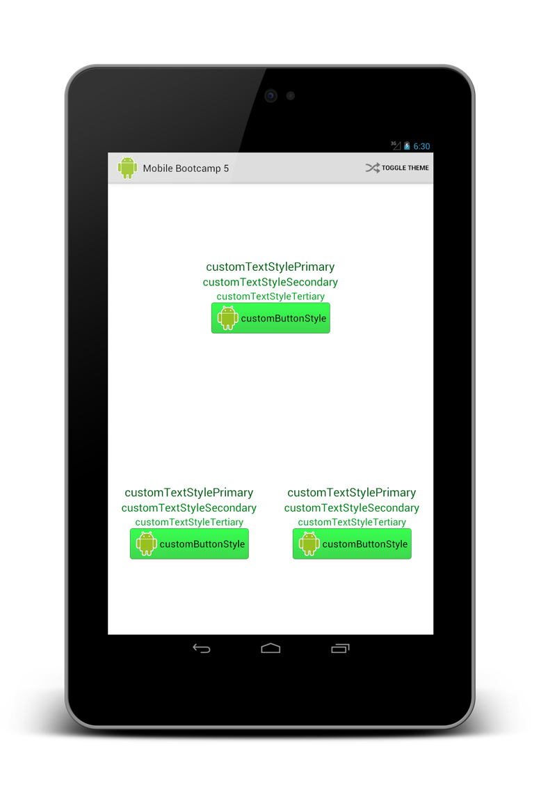

##### App on Android 3.0+ (API 11+), large size device, landscape

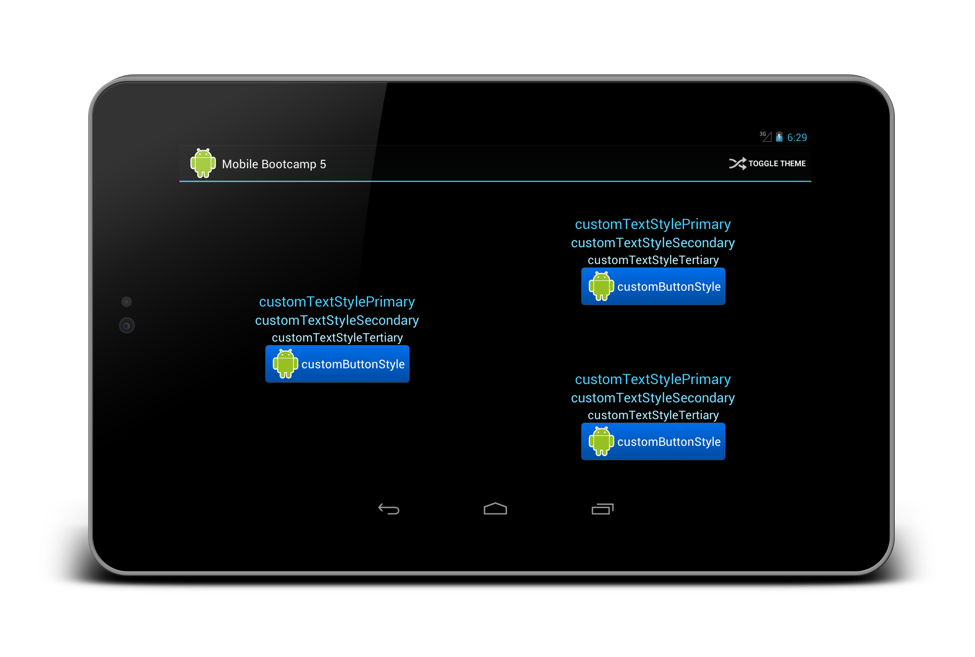
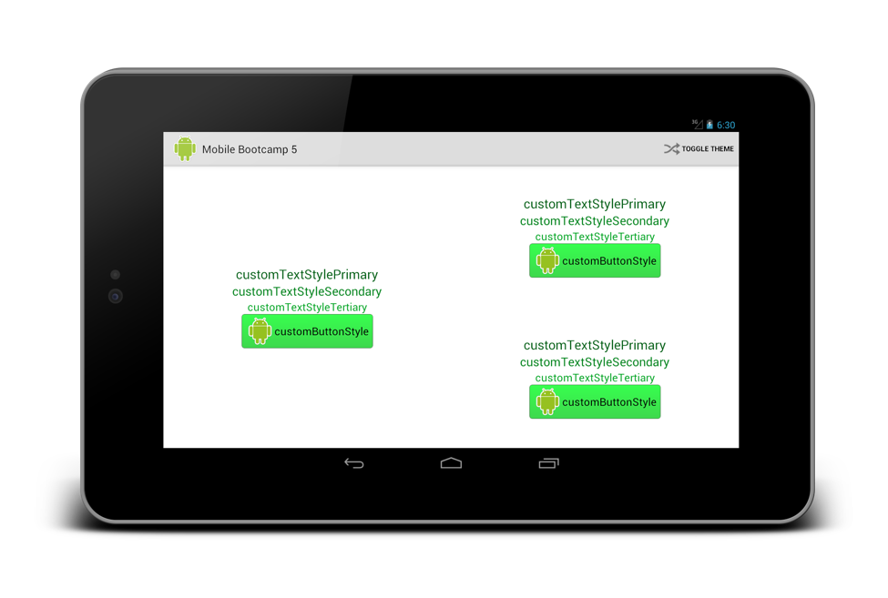

## Helpful Resources
*For the needed resources, see: "./supporting-resources/"*

These are some helpful documentation links and resources to help you be successful in completing this tech challenge:

* Web resources
    * [http://www.androidengineer.com/2010/06/using-themes-in-android-applications.html](http://www.androidengineer.com/2010/06/using-themes-in-android-applications.html)
    * [http://developer.android.com/design/index.html](http://developer.android.com/design/index.html)
        * [http://developer.android.com/design/get-started/ui-overview.html](http://developer.android.com/design/get-started/ui-overview.html)
        * [http://developer.android.com/design/style/themes.html](http://developer.android.com/design/style/themes.html)
        * [http://developer.android.com/design/patterns/index.html](http://developer.android.com/design/patterns/index.html)
        * [http://developer.android.com/design/building-blocks/index.html](http://developer.android.com/design/building-blocks/index.html)
    * [http://developer.android.com/guide/topics/ui/themes.html](http://developer.android.com/guide/topics/ui/themes.html)
    * [http://android-ui-utils.googlecode.com/hg/asset-studio/dist/index.html](http://android-ui-utils.googlecode.com/hg/asset-studio/dist/index.html)
    * [http://developer.android.com/guide/topics/resources/providing-resources.html ](http://developer.android.com/guide/topics/resources/providing-resources.html )
    * [http://developer.android.com/guide/topics/resources/drawable-resource.html#StateList](http://developer.android.com/guide/topics/resources/drawable-resource.html#StateList)
    * [http://developer.android.com/guide/topics/ui/menus.html#xml](http://developer.android.com/guide/topics/ui/menus.html#xml)
    * [http://developer.android.com/guide/topics/ui/actionbar.html#Adding](http://developer.android.com/guide/topics/ui/actionbar.html#Adding)

## Submission Instructions
Please provide these specific items when submitting your tech challenge, placing them inside of your repository where your grader can easily find them:

* An application that meets the above requirements running on the target mobile device is required for completion of this assignment. Please place the `.apk` file of the completed app in the base directory of your repository.
* The code for your submission should be at the base directory of the repo, or within a specified child directory.

### Git Workflow
* When you start a tech challenge, the tech challenge admin will create a private repository for you.
* There will be two branches in the repo, `master` and `develop`.
* Do all your work in the `develop` branch.
* As you work, push your changes up to your GitLab repo.
* When you are finished, make a merge request to the `master` version of your private repo.
* At this point, the graders will review your merge request and offer comments where needed.
* You may be asked to push updates, corrections to your develop branch in response to the coments by graders. You `don't` need to create another merge request.
* When the grader is satisfied, he will merge your code into the master branch of your private repo.
* Now celebrate, the Tech Challenge is completed!

## Help and Discussion

If you need help on this Tech Challenge or would like to discuss it / leave feedback, please check out the [Mobile Tech Challenges team](https://teams.microsoft.com/l/team/19:3c6cb4196d9d47b9ad2510126e14ad44@thread.skype/) in Microsoft Teams, especially the [Help and Discussion channel](https://teams.microsoft.com/l/channel/19:bb28957ec53d452787c8c3aeae850127@thread.skype/Mobile%20-%20Android%20-%20Help%20and%20Discussion).
